# AR Инвентаризация · КГМК

> Мобильное AR-приложение: сканирование QR-кодов, интерактивные 3D-панели в дополненной реальности, голосовое управление, офлайн-режим и синхронизация данных.

<p>
  
  
  
  
  
</p>

## Содержание
1. [О проекте](#1-о-проекте)
2. [Ключевые возможности](#2-ключевые-возможности)
3. [Экраны приложения](#3-экраны-приложения)
4. [Архитектура](#4-архитектура)
5. [Технологический стек](#5-технологический-стек)
6. [Структура репозитория](#6-структура-репозитория)
7. [Сервер и данные](#7-сервер-и-данные)
8. [Быстрый старт](#8-быстрый-старт)

---

## 1. О проекте

Приложение разработано для автоматизации инвентаризации на предприятиях компании **«Норникель»**. Сотрудник сканирует QR-код продукции — и система в режиме дополненной реальности поднимает интерактивные 3D-панели: модель объекта, документацию о готовой продукции и калькулятор для подсчёта.

Проект построен на **гибридной схеме хранения данных**: на устройстве работает локальная база SQLite (полноценный офлайн-режим), а кнопка «Синхронизировать» объединяет локальные изменения с глобальной базой PostgreSQL через собственный сервер на C#.

---

## 2. Ключевые возможности

| Модуль | Что умеет |
|---|---|
| Авторизация | Вход по отделу, ФИО и паролю; выбор варианта подключения |
| QR-сканирование | Нативный Kotlin-модуль; сценарий «QR не найден в базе» с обновлением данных |
| AR-сцена | Создание объектов и взаимодействие с ними; три 3D-панели: модель объекта (веб), информация о продукции, калькулятор |
| Голосовое управление | Google Speech Recognition; голосовые подсказки на экранах входа и меню |
| Данные | Офлайн-работа на SQLite; синхронизация с PostgreSQL по Wi-Fi или USB |
| Админ-панель | Пользователи (создание, отключение, поиск), QR-коды, журнал операций |
| API | REST-эндпоинты + интерактивная Swagger-документация |

---

## 3. Экраны приложения

### Авторизация и голосовая помощь

<table>
  <tr>
    <td align="center">
      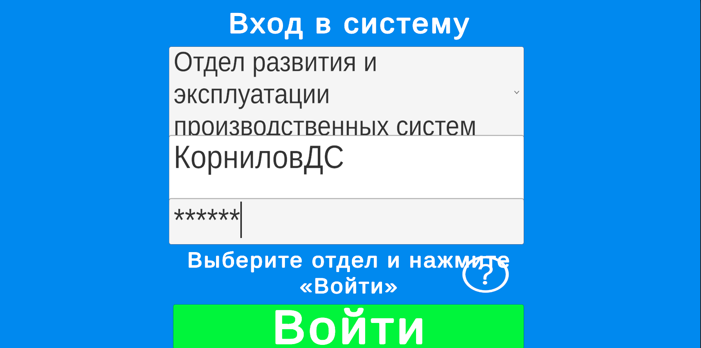<br />
      <sub>Вход: отдел, ФИО, пароль</sub>
    </td>
    <td align="center">
      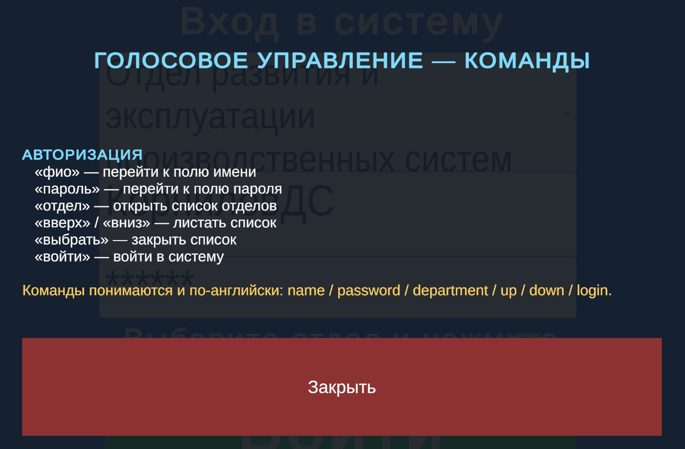<br />
      <sub>Голосовая подсказка на экране входа</sub>
    </td>
  </tr>
</table>

### Главное меню и инструкция

<table>
  <tr>
    <td align="center">
      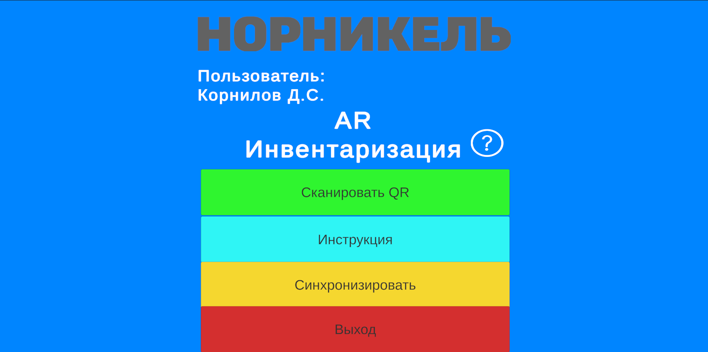<br />
      <sub>Главное меню</sub>
    </td>
    <td align="center">
      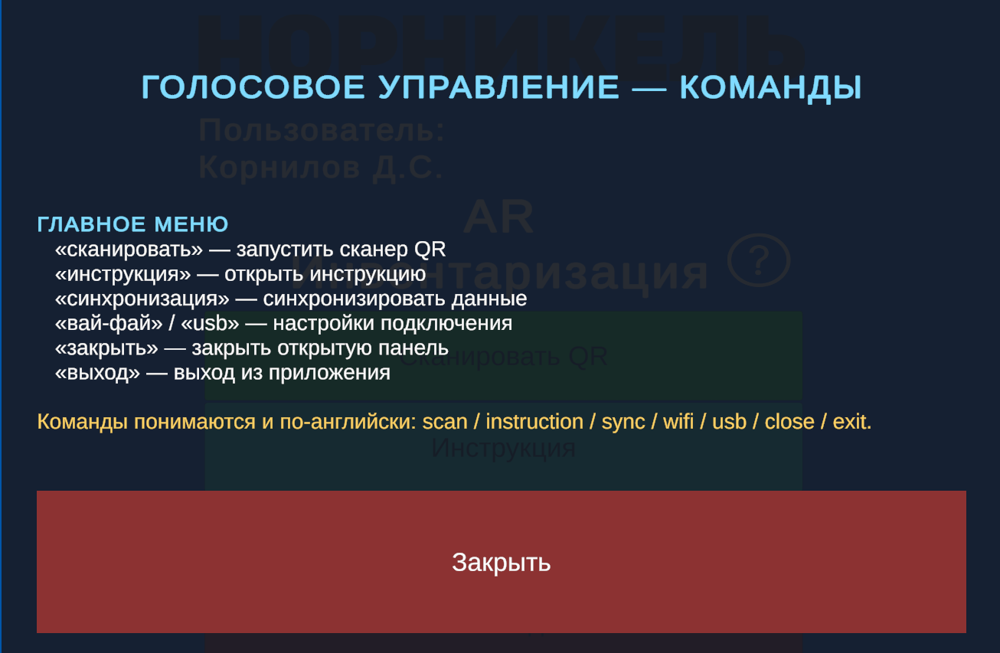<br />
      <sub>Голосовая подсказка в меню</sub>
    </td>
    <td align="center">
      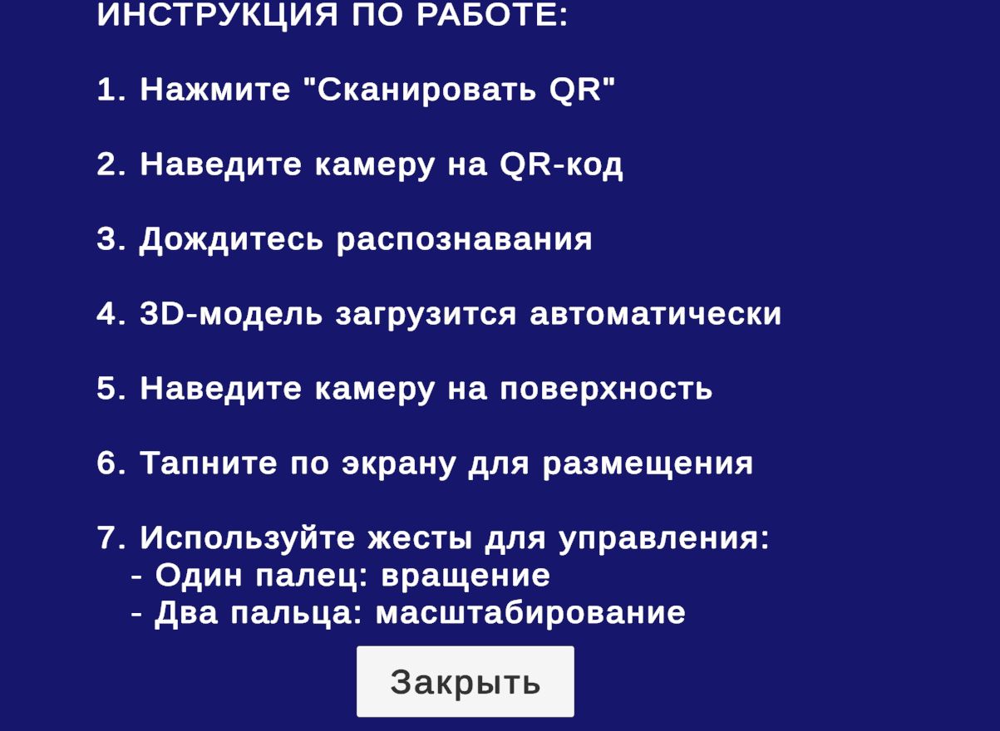<br />
      <sub>Встроенная инструкция</sub>
    </td>
  </tr>
</table>

### AR-сцена и 3D-панели

<table>
  <tr>
    <td align="center">
      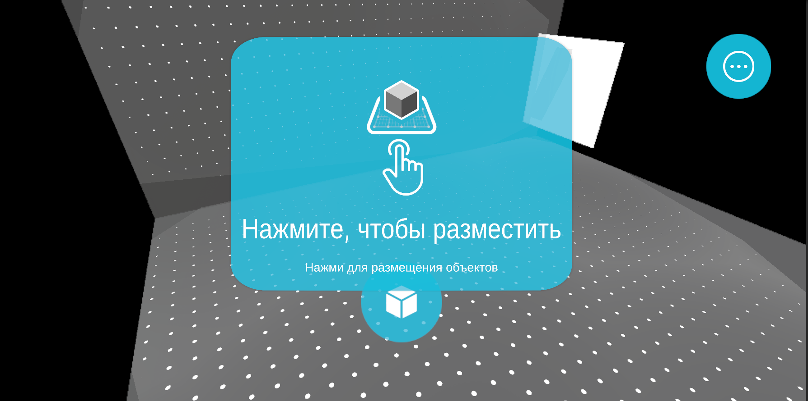<br />
      <sub>AR-сцена с панелями</sub>
    </td>
    <td align="center">
      <br />
      <sub>Все объекты на сцене</sub>
    </td>
  </tr>
  <tr>
    <td align="center">
      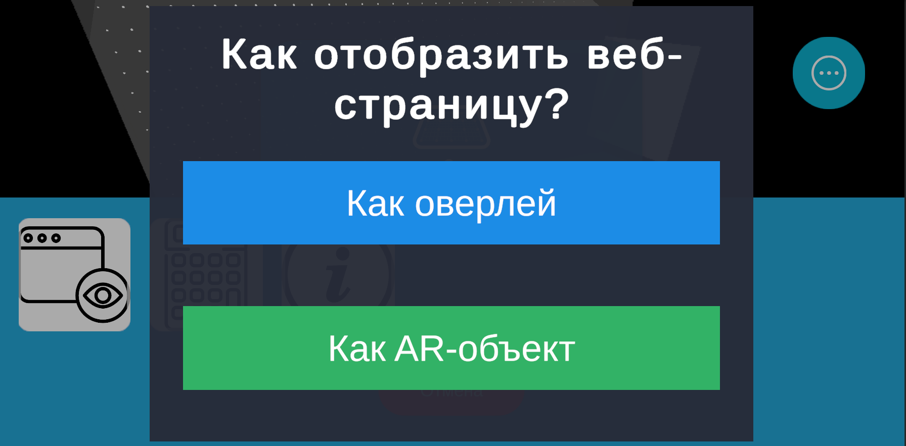<br />
      <sub>Веб-представление: варианты отображения</sub>
    </td>
    <td align="center">
      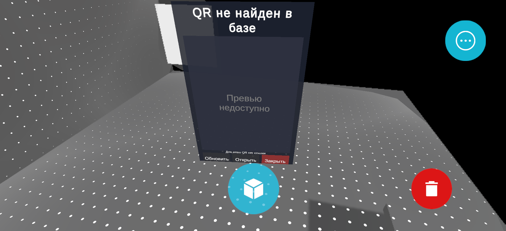<br />
      <sub>Веб-представление объекта по QR</sub>
    </td>
  </tr>
  <tr>
    <td align="center">
      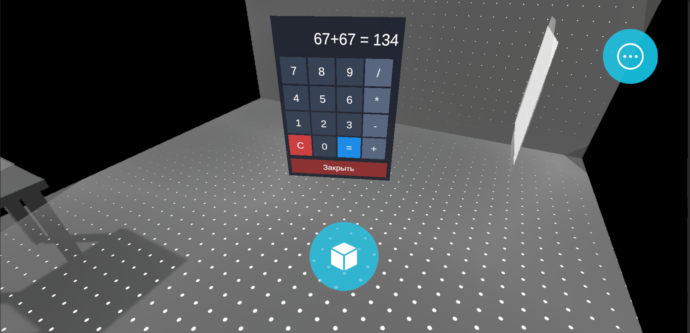<br />
      <sub>3D-калькулятор для подсчёта</sub>
    </td>
    <td align="center">
      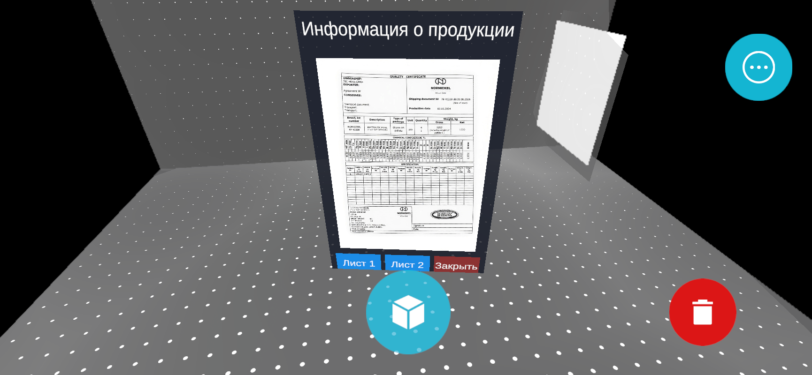<br />
      <sub>Информация о готовой продукции</sub>
    </td>
  </tr>
</table>

---

## 4. Архитектура

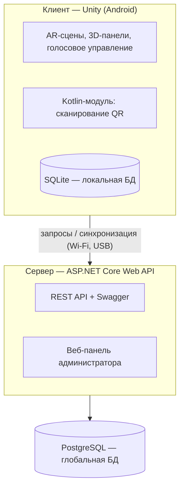

Клиент полностью автономен за счёт SQLite, сервер выступает единой точкой входа к глобальным данным и административному интерфейсу.

---

## 5. Технологический стек

| Слой | Технологии |
|---|---|
| Движок | Unity, XR Interaction Toolkit, ARCore |
| Клиент | C# |
| Android-модуль | Kotlin (QR-сканер) |
| Сервер | ASP.NET Core Web API, Swagger |
| Глобальная БД | PostgreSQL |
| Локальная БД | SQLite |
| Голос | Google Speech Recognition |
| Целевая платформа | Android 8.0+ |

---

## 6. Структура репозитория

```text
AR_Unity/
├── Assets/              # Unity: сцены, скрипты, префабы, плагины
├── Backend/             # Сервер (ASP.NET Core Web API)
│   ├── Program.cs       #   точка входа, конфигурация API
│   ├── appsettings.json #   строка подключения к PostgreSQL
│   ├── admin.html       #   веб-панель администратора
│   ├── main.js          #   логика админ-панели
│   └── style.css        #   стили админ-панели
├── Packages/            # Пакеты Unity (XR Interaction Toolkit и др.)
├── ProjectSettings/     # Настройки проекта Unity
├── docs/screenshots/    # Скриншоты для документации
└── AR_Unity.sln         # Решение C#
```

---

## 7. Сервер и данные

- **PostgreSQL** — источник истины: QR-коды, пользователи, журнал операций.
- **ASP.NET Core Web API** — REST-слой между клиентом и базой; раздаёт админ-панель и Swagger.
- **SQLite** — рабочая копия на устройстве; инвентаризация возможна без сети.
- **Синхронизация** — слияние локальных изменений с глобальной базой по Wi-Fi или USB.

---

## 8. Быстрый старт

### Готовый APK
1. Скачайте APK из [Releases](https://github.com/Dimasyaaa/AR_Unity/releases).
2. Разрешите установку из неизвестных источников.
3. Предоставьте доступ к камере и микрофону.

### Сборка клиента (Unity)
```text
File → Build Settings → Android → Switch Platform
Player Settings: Package Name = com.dimasyaaa.arunity
                 Minimum API Level = Android 8.0 (API 26)
                 Scripting Backend = IL2CPP, Architectures = ARM64
Build → AR_Unity.apk
```

### Запуск сервера
```bash
cd Backend
# строка подключения к PostgreSQL — в appsettings.json
dotnet run
```
После старта в консоли появятся адреса API, Swagger и админ-панели.

---